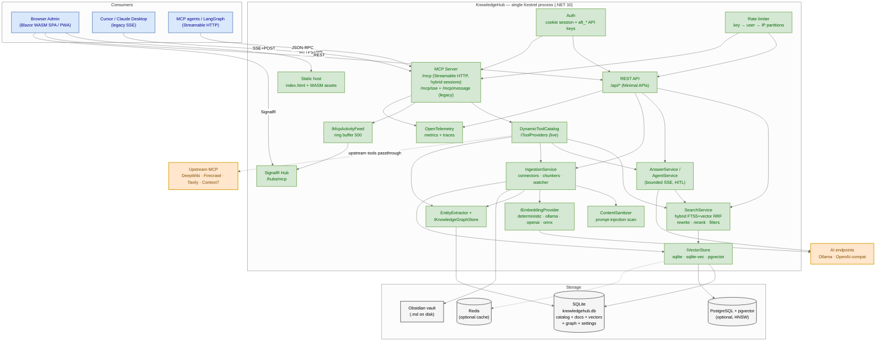
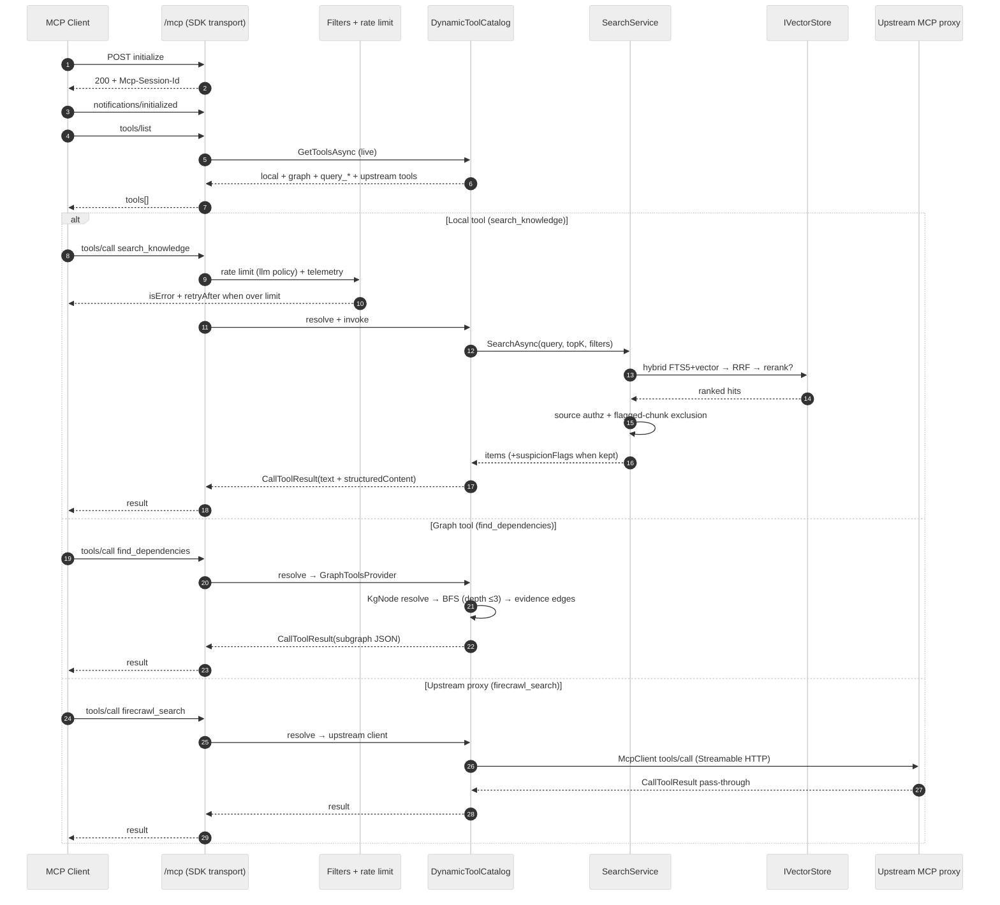
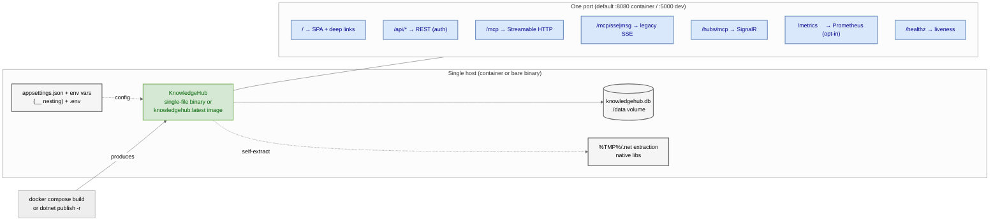

# KnowledgeHub — System Architecture

All-in-one standalone .NET 10 platform: a **single Kestrel process** serves the Blazor WebAssembly admin SPA, the REST management API, a native **MCP server** (Streamable HTTP in hybrid session mode — `initialize` clients get sessions, `2026-07-28` clients are served statelessly — plus legacy HTTP/SSE) and a SignalR monitor hub. Agentic RAG over user-registered knowledge sources (Obsidian vaults, web pages, document files, Notion, REST APIs, SQL) with **GraphRAG** entity/relation extraction, prompt-injection defense, partitioned rate limiting, and OpenTelemetry observability.

> Source of truth: `.specs/` (SPEC-*, all `Done`). Diagram sources: `*.mmd` (Mermaid) + `knowledge-hub-architecture.drawio` (editable XML). Decisions: `AD-*.md` in this directory.

## 1. Context & Container view



| Layer | Component | Responsibility |
|---|---|---|
| Consumers | Browser (Blazor WASM) | `/sources`, `/mcp-monitor`, `/playground`, `/chat`, `/settings`, `/api-keys`, `/approvals`, `/eval` |
| | MCP clients | Streamable HTTP `/mcp` or legacy SSE `/mcp/sse` + `/mcp/message` |
| Edge | Static host | `index.html` + WASM assets, SPA fallback |
| | REST API | Minimal APIs under `/api/*` — see `docs/en/API.md` |
| | MCP transport | `ModelContextProtocol.AspNetCore` 2.2.0, `Mcp:SessionMode` hybrid |
| | SignalR hub | `/hubs/mcp` — live sessions + call log |
| Security | Auth | Cookie session (12 h sliding, lockout) + `aft_*` API keys (SHA-256 hash only) |
| | Rate limiting | `System.Threading.RateLimiting` — partitions `key:`/`user:`/`anon:`; per-key overrides via `IApiKeyRateLimitResolver` |
| | `ContentSanitizer` | Heuristic injection scan at ingest → `DocumentChunk.SuspicionFlags` + `security_events`; exclusion default-on |
| | Source authorization | Per-key `AllowedSourceIdsJson`/`AllowedToolsJson` enforcement in `SearchService` |
| Core | `DynamicToolCatalog` | Live tool resolution per `tools/list`; `IToolCatalogChangeNotifier` pushes `tools/list_changed` |
| | `IngestionService` | Connector → chunker (markdown/code/config) → injection scan → embed → vector upsert → optional graph extraction |
| | `SearchService` | Hybrid FTS5 + vector (RRF), optional query rewriting + LLM reranker, metadata filters, source authz, flagged-chunk exclusion |
| | `AnswerService` / `AgentService` | LLM synthesis with `[n]` citations; agent loop with tool-calling, HITL approvals, bounded SSE, conversation threads + summarization |
| | `EntityExtractor` + `IKnowledgeGraphStore` | LLM entity/relation extraction → `KgNodes`/`KgEdges`/`KgAliases` (SQLite adjacency); tools `find_dependencies`/`find_dependents`/`find_path`/`analyze_impact` |
| | `IEmbeddingProvider` | `deterministic` · `ollama` · `openai` · `onnx` (local all-MiniLM-L6-v2) |
| | `IVectorStore` | `sqlite` (chunk columns) · `sqlite-vec` (KNN) · `postgres`/pgvector (HNSW, batched upserts, metadata jsonb) |
| | `EvalRunner` | Versioned eval datasets → Recall@K / P@K / MRR / faithfulness reports |
| | `IDistributedCache` | `memory` (default) · `redis`; search/embedding/answer cache regions |
| | `IMcpActivityFeed` | Ring buffer (500) → SignalR broadcast |
| | Telemetry | `System.Diagnostics` `Meter`/`ActivitySource` → OTLP/Prometheus opt-in |
| Storage | SQLite `knowledgehub.db` | Catalog, documents, chunks (FTS5), vectors (default), knowledge graph, settings, eval runs, security events — beside the executable |
| | PostgreSQL + pgvector | Optional vector backend (catalog stays in SQLite) |
| | Redis | Optional `IDistributedCache` backend |
| External | Upstream MCP proxies | DeepWiki (public + private), Firecrawl, Tavily, Context7 — secrets encrypted at rest |
| | Ollama / OpenAI-compat | Chat + embedding generation endpoints (HTTP resilience: retry + circuit breaker) |

## 2. MCP request flow (tools/call)



- `tools/list` resolves **live** per call; source/settings mutations broadcast `notifications/tools/list_changed`.
- Rate limiting: LLM-spending tools (`ask_knowledge`, `agent_chat`, `search_knowledge`) and write tools (`write_knowledge`, `write_note`) are charged per partition; over-limit calls return `isError` + retry hint (no 429 in JSON-RPC).
- Execution failures → `CallToolResult { isError: true }` — never break the session stream.

## 3. Tool catalog

| Tool | Type | Availability |
|---|---|---|
| `search_knowledge` | hybrid/semantic/lexical search, metadata filters | always |
| `ask_knowledge` | retrieval + cited answer | always |
| `agent_chat` | tool-calling agent loop, HITL, threads | always |
| `write_knowledge` | persist + index content | always (write gate) |
| `query_{slug}` | per-source filtered search | per active source |
| `read_document` | read vault note (`SafePath`) | ≥1 active ObsidianVault |
| `write_note` | write vault `.md` + re-index | ≥1 active ObsidianVault (write gate) |
| `find_dependencies` · `find_dependents` · `find_path` · `analyze_impact` | knowledge graph traversal | `Graph:Enabled` (default **on**) |
| `set_api_key_settings` | per-key chat/integration config | always |
| `ask_question` · `read_wiki_structure` · `read_wiki_contents` | DeepWiki proxy | `DeepWiki:Enabled` |
| `firecrawl_*` (6 tools) | Firecrawl proxy | `Firecrawl:Enabled` + key |
| `tavily_*` (6 tools) | Tavily proxy | `Tavily:Enabled` + key |
| `resolve-library-id` · `query-docs` | Context7 proxy | `Context7:Enabled` + key |

Resources: `knowledge://sources` (catalog JSON) + `obsidian://{slug}/{path}` per indexed document.

## 4. Deployment



- `docker compose up -d` builds `knowledgehub:latest`; `./data` persists SQLite + uploads; EF migrations run at startup (`DatabaseMigrator`).
- `dotnet publish -r <RID>` produces a single-file self-contained binary; `install.sh --host --systemd` installs a hardened systemd unit.
- `backup.sh`/`restore.sh` cover SQLite + uploads.

## 5. Configuration surface

```jsonc
{
  "Database":    { "Path": "knowledgehub.db" },
  "Embeddings":  { "Provider": "deterministic|ollama|openai|onnx", "Endpoint": "...",
                   "ApiKey": "", "Model": "nomic-embed-text", "Dimensions": 384,
                   "ModelPath": "models/all-MiniLM-L6-v2" },
  "VectorStore": { "Provider": "sqlite|sqlite-vec|postgres", "ConnectionString": "" },
  "Chat":        { "Provider": "none|ollama|openai", "Endpoint": "...",
                   "Model": "llama3.2", "ApiKey": "", "TimeoutSeconds": 120 },
  "Search":      { "Lexical": { "Enabled": true },
                   "QueryRewrite": { "Enabled": false, "LexicalToo": false },
                   "Rerank": { "Enabled": false, "MaxCandidates": 50 } },
  "Cache":       { "Provider": "memory|redis", "Redis": { "ConnectionString": "" },
                   "AnswerCache": { "Enabled": false, "TtlSeconds": 600 } },
  "RateLimiting":{ "Enabled": true, "LlmPermitLimit": 20, "LlmWindowSeconds": 60,
                   "AnonymousLlmPermitLimit": 5, "SyncPermitLimit": 10,
                   "SyncWindowSeconds": 3600, "GeneralPermitLimit": 300,
                   "GeneralWindowSeconds": 60, "TrustForwardedHeaders": false },
  "Security":    { "Injection": { "ExcludeFlagged": true } },
  "Graph":       { "Enabled": true, "MaxChunksPerSync": 200,
                   "MaxChunkChars": 2000, "MaxResults": 200 },
  "Telemetry":   { "Otlp": { "Endpoint": "" }, "Metrics": { "Prometheus": false } },
  "Mcp":         { "SessionMode": "StatefulForInitializeClients",
                   "MaxConcurrentCallsPerSession": 8, "ActivityFeedCapacity": 500 },
  "Auth":        { "AdminInitialPassword": "123qwe", "SessionHours": 12 },
  "Host":        { "ShutdownTimeoutSeconds": 30 }
}
```

Runtime-editable settings (stored in SQLite, override env, no restart): **Chat** (`/api/settings/chat`), **Graph** (`/api/settings/graph`), **integration secrets** (`/api/settings/integrations/*`), and **per-API-key** chat/integration/rate-limit/scopes overrides (`/api/api-keys/{id}/*`).

Security boundaries: source configs are **redacted** in API responses; vault paths reject `..`; `AllowedHosts` restricted to localhost; secrets live in env vars or the encrypted `IntegrationSecrets` store; embedding model changes are detected via `EmbeddingModel` stamping so stale vectors are never mixed.

## Editable diagram

`knowledge-hub-architecture.drawio` mirrors section 1 — open in [draw.io / diagrams.net](https://app.diagrams.net) to edit. `runtime-architecture.html` is an interactive trace-enabled view (archify) for the same runtime.

## Decision records

See `AD-*.md` in this directory — indexed in `docs/architecture/README.md`.
