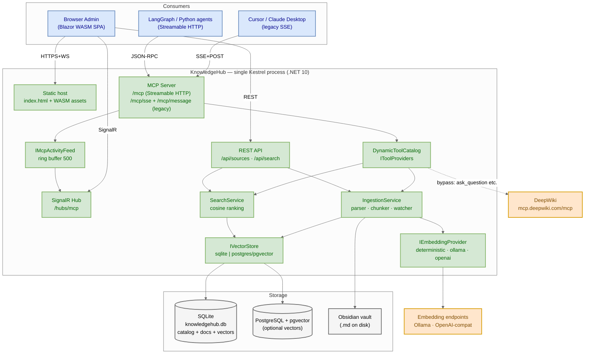
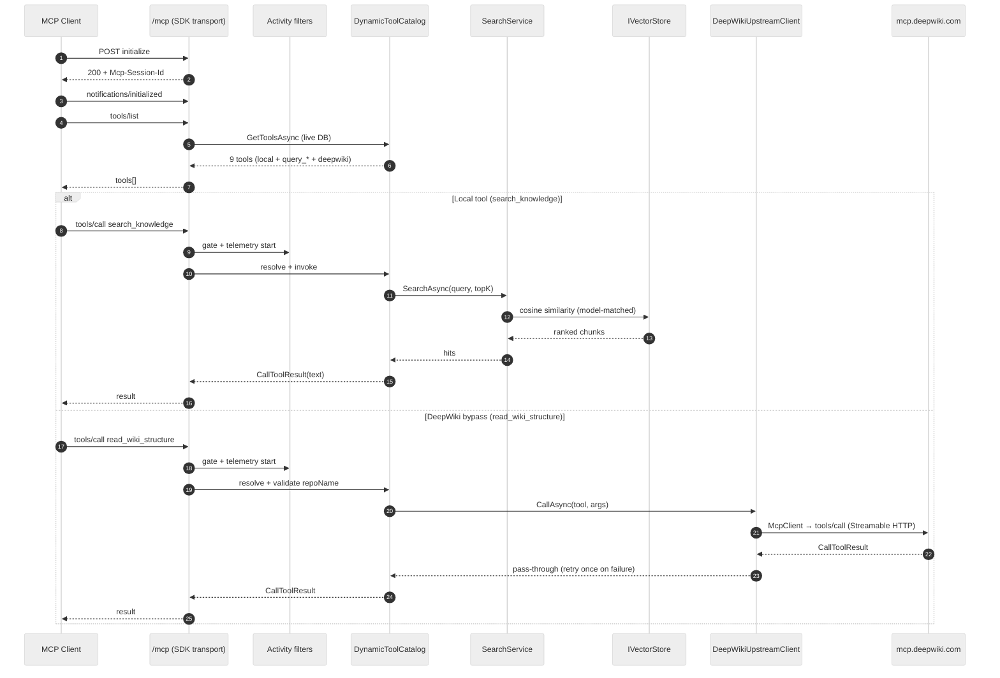
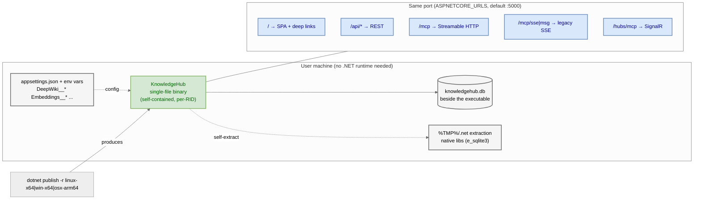

# KnowledgeHub — System Architecture

All-in-one standalone .NET 10 platform: a **single Kestrel process** serves the Blazor WebAssembly admin SPA, the REST management API, a native **MCP server** (Streamable HTTP + legacy HTTP/SSE) and a SignalR monitor hub. Agentic RAG over user-registered knowledge sources (Obsidian vaults, web pages, documents, APIs, SQL).

> Source of truth: `.specs/` (SPEC-20260913-*, approved). Diagram sources: `*.mmd` (Mermaid) + `knowledge-hub-architecture.drawio` (editable XML).

## 1. Context & Container view



| Layer | Component | Responsibility |
|---|---|---|
| Consumers | Browser (Blazor WASM) | `/sources` CRUD, `/mcp-monitor` (live), `/playground` (search) |
| | Cursor / Claude Desktop | legacy SSE `GET /mcp/sse` + `POST /mcp/message` |
| | LangGraph / Python agents | Streamable HTTP `POST /mcp` |
| Edge | Static host | `index.html` + WASM assets, SPA fallback for `/sources` etc. |
| | REST API | `/api/sources`, `/api/search` (Minimal APIs) |
| | MCP transport | `MapMcp("/mcp")`, `EnableLegacySse` — official `ModelContextProtocol.AspNetCore` |
| | SignalR hub | `/hubs/mcp` — live sessions + call log |
| Core | `DynamicToolCatalog` | Resolves tools live per `tools/list` from `IToolProviders` |
| | `IngestionService` | Markdown parse → chunk (500/50 tok) → embed → upsert |
| | `VaultWatcherService` | `FileSystemWatcher` → debounce → re-index |
| | `SearchService` | Cosine similarity over model-matched chunks |
| | `IEmbeddingProvider` | `deterministic` (default) · `ollama` · `openai` — endpoint/key/model/dimensions via config |
| | `IVectorStore` | `sqlite` (default) · `postgres`/pgvector |
| | `IMcpActivityFeed` | Ring buffer (500) → SignalR broadcast |
| Storage | SQLite `knowledgehub.db` | Catalog (sources/docs/chunks) + vectors — beside the executable |
| | PostgreSQL + pgvector | Optional vector backend (catalog stays in SQLite) |
| | Obsidian vault | `.md` files on disk — `SafePath` confines reads/writes to vault root |
| External | `mcp.deepwiki.com/mcp` | Upstream bypass via `McpClient` (`HttpClientTransport AutoDetect`) |
| | Ollama / OpenAI-compat | Embedding generation endpoints |

## 2. MCP request flow (tools/call)



- `tools/list` resolves **live** from the DB per call; source mutations broadcast `notifications/tools/list_changed` to connected sessions.
- Invalid params → `McpProtocolException` → JSON-RPC `-32602` (handled by the SDK).
- Execution failures → `CallToolResult { isError: true }` — never break the SSE stream.
- DeepWiki calls pass through with the **same tool names** as upstream (`ask_question`, `read_wiki_structure`, `read_wiki_contents`); `DeepWiki:ApiKey` is only sent as the upstream `Authorization` header.

## 3. Tool catalog

| Tool | Type | Availability |
|---|---|---|
| `search_knowledge` | local — ranked semantic search, all active sources | always |
| `ask_knowledge` | local — retrieval aggregate (ranked passages + citations) | always |
| `write_knowledge` | local — persist & index content (vault `.md` or DB doc) | always |
| `query_{slug}` | local — per-source filtered search | per active source |
| `read_document` | local — read vault note (`SafePath`) | ≥1 active ObsidianVault |
| `write_note` | local — write vault `.md` + re-index | ≥1 active ObsidianVault |
| `ask_question` · `read_wiki_structure` · `read_wiki_contents` | DeepWiki bypass | `DeepWiki:Enabled` |

Resources: `knowledge://sources` (catalog JSON) + `obsidian://{slug}/{path}` per indexed document.

## 4. Deployment



`dotnet publish -r <RID>` produces a **single-file self-contained binary** (~120 MB) — no .NET runtime, Python, container or external UI service required. `knowledgehub.db` is created beside the executable; native libs self-extract to `%TMP%/.net`. All endpoints share one port (`ASPNETCORE_URLS`, `AllowedHosts` restricted to localhost).

## 5. Configuration surface

```jsonc
{
  "Embeddings":  { "Provider": "deterministic|ollama|openai", "Endpoint": "...", "ApiKey": "...", "Model": "...", "Dimensions": 384 },
  "VectorStore": { "Provider": "sqlite|postgres", "ConnectionString": "Host=...;Database=knowledgehub" },
  "DeepWiki":    { "Enabled": true, "Endpoint": "https://mcp.deepwiki.com/mcp", "ApiKey": "", "TimeoutSeconds": 60 }
}
```

Security boundaries: source configs are **redacted** (`connectionString`, `apiKey`, `key`, `headers`, `token`, `password`, `secret`) in every API response; vault paths reject `..` and canonical escapes; embeddings record `EmbeddingModel` (`{provider}:{model}`) so stale vectors are ignored after a model switch.

## Editable diagram

`knowledge-hub-architecture.drawio` mirrors section 1 — open in [draw.io / diagrams.net](https://app.diagrams.net) to edit.
